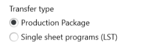

## How to add orders to the production plan of the machine

There is no OPC UA method. Orders are added to the production plan via the file interface LST or TPP.

### Definitions for cutting machines

Since different parts are nested to one sheet, there might be a 1:1 or 1:N relationship to customer orders, depending on the company process.

##### Machine: ProgramName
The Program describes how to cut one sheet metal.

##### Machine: ProductionOrderIdentifier [TruTops Boost: Manufacturing order description]
The ProductionOrder defines a concrete production task. A ProductionOrder defines the task to cut a Program n-times and defines a name for the task, the ProductionOrderIdentifier. Apart from the program count other additional parameters, like the sequence number for loading and unloading, can be set in the ProductionOrder.

##### Machine: ProductionPackageName [TruTops Boost: Job no., Job name]
The third level of aggreagation is the ProductionPackage. It can be used to combine several ProductionOrders and give them a common name, the ProductionPackageName. For example to relate several ProductionOrders to an assembly group.

##### Machine: Production plan
The production plan is the "playlist" on the machine and consists of production orders, which migth be grouped to production packages.


### Production plan functionalities via LST file:

Production orders can be appended to the production plan of the machine using a FERTIGUNG_AUFTRAG_TMP section in the LST file.


```
BEGIN_FERTIGUNG_AUFTRAG_TMP
C
ZA,MM,6
MM,AT,1,  10,1,1,,'Jobname'                           ,,'',T
MM,AT,1,  20,1,1,,'FertAuftrBez'                      ,,'',T
MM,AT,1,  30,1,1,,'FertStatus'                        ,,'',T
MM,AT,1,  40,1,1,,'Programmname'                      ,,'',T
MM,AT,1,  50,1,1,,'SollAnzahl'                        ,,'',Z
MM,AT,1,  60,1,1,,'IstAnzahl'                         ,,'',Z
C
ZA,DA,1
DA,'JOB001','JOB0010101','471101',5,0
DA,'JOB001','JOB0010102','4702',1,0
C
ENDE_FERTIGUNG_AUFTRAG_TMP

```

| Id    | Name            | Comments               |
| ----- | ----------------| ---------------------  |
| 10    | JobName, ProductionPackageName | 
| 20    | ManufacturingOrder, ProductionOrderIdentifier | Must be unique in the production plan. |
| 30    | ManufacturingStatus, ProductionOrderState    | (optional) 0=Released, 9=Disabled |
| 40    | ProgramName     |
| 50    | TargetQuantitiy | Number of sheet metal program runs.
| 60    | CurrentQuantity | (optional) default=0

If a LST containing a FERTIGUNG_AUFRAG_TMP section is imported, the production plan gets filled. The FERTIUNG_AUFTRAG_TMP section can exist in addition to the program in the LST or as the sole entry.

### Activate FERTIGUNG_AUFTRAG_TMP section in TruTops Boost

To auto generate the section, set the **Transfer type** to "Production Package" in the workplace settings of a machine in HomeZone.

