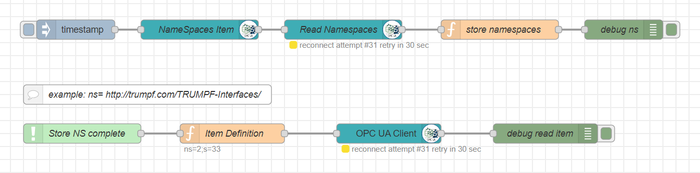

## NodeRed OPC UA Client Examples

### Introduction
 
Everything is provided as open source to provide examples on how to work and program with OPC UA. For the open source tools and examples there is no official TRUMPF support. Feel free to participate.

### Examples

#### Resolve namespaces - flow_resolveNamespace.json
Example how to resolve namespace uri to namespace index. Namespace index should never be hardcoded in OPC UA, which is currently not done well in the node-red opc ua module.

### Installation and Execution
Download the example flow files and import them in node-red.
Easiest way is to download all files of the github repository. [Download zip](https://github.com/TRUMPF-IoT/OpcUaMachineTools/archive/main.zip). 

### License
The NodeRed OPC UA examples are licensed under the MIT License.
